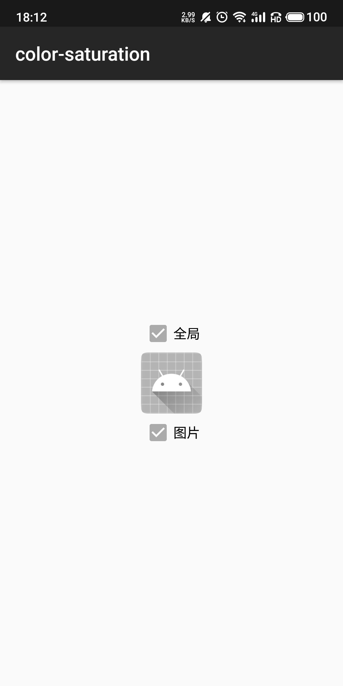
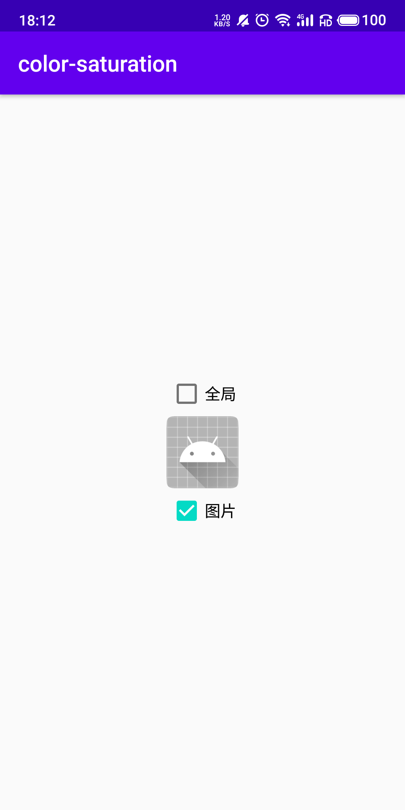

## color-saturation
> 一行代码实现全局变灰，支持指定View

#### 饱和度范围(0.0~1.0)
> SaturationScale.GRAY = 0  
> SaturationScale.IDENTITY = 1

#### 全局变灰
Application#onCreate初始化  

```java
ColorSaturation.init(SaturationScale.GRAY | SaturationScale.IDENTITY);
```


#### 指定View
```java
ColorSaturation.apply(View, SaturationScale.GRAY | SaturationScale.IDENTITY);
```
